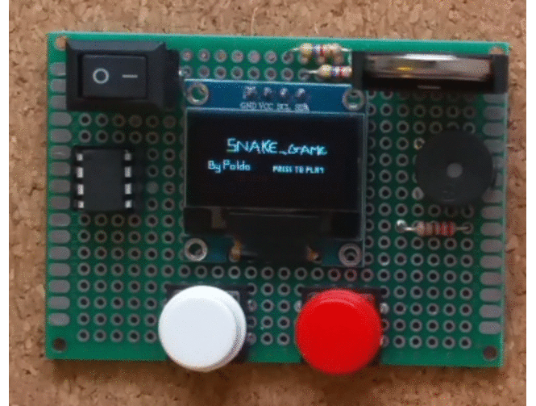

# Tiny-snake-board
This repository contains the source code I've written to make a tiny gaming board based on Attiny85 microcontroller.
 All the code has been written from scratch, using my own drivers, for didactic purpose.   
I've also chosen to use the AVR assembly language to have a full control of the microcontroller and to learn as much as possible.   
I had strict constraints due to the low amount of SRAM available in the Attiny85 (512 Bytes).   
I really loved this project and I'm planning to do something similar with a more powerful mcu.

